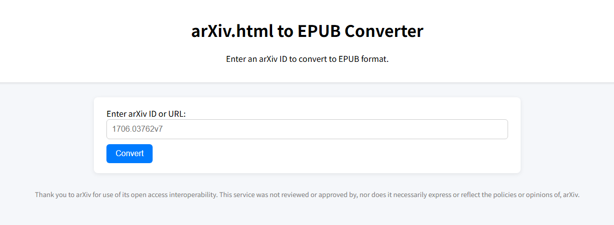

# arXiv.html to EPUB
Static HTML for fetching arXiv html and converting to EPUB file.



## LICENSE
This repository is licensed under MIT. See [LICENSE](./LICENSE).

## External libraries
### arXiv CSS (./arxiv_styles/*)
The license is unknown. Maybe [CC0 1.0 Universal](https://creativecommons.org/publicdomain/zero/1.0/) according to https://info.arxiv.org/help/license/index.html#metadata-license

### JSZip (./jszip.min.js)
```
JSZip v3.10.1 - A JavaScript class for generating and reading zip files
<http://stuartk.com/jszip>

(c) 2009-2016 Stuart Knightley <stuart [at] stuartk.com>
Dual licenced under the MIT license or GPLv3. See https://raw.github.com/Stuk/jszip/main/LICENSE.markdown.

JSZip uses the library pako released under the MIT license :
https://github.com/nodeca/pako/blob/main/LICENSE
```